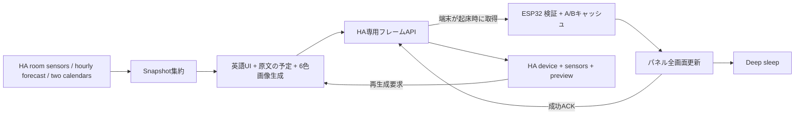

# Implementation Plan

対象はLayout B。HAカスタム統合とESP32の表示経路は未実装。要件は[spec.md](spec.md)、画面の寸法は[selected-layout.md](selected-layout.md)。

## アーキテクチャ

HAに`custom_components/photopainter`を追加する。HA内の温湿度states、weather.get_forecastsのhourly応答、2人のcalendarの当日範囲イベントを取得する。HA自身から自分のREST APIへトークン付きでアクセスする必要はない。端末とのHTTP APIは新設するもので、現環境に存在するAPIではない。

HAは1フレームずつexecutorで描画し、イベントループで画像処理/ファイルI/Oを行わない。stateイベントはdirtyにするだけで、全イベントごとにフレームを生成しない。起床予定直前の生成と管理者の再生成要求をまとめる。生成に失敗した場合も前世代を配信するが、古い生成/取得日時を維持する。

HTTP認証は端末専用キー。標準HAの認証を無条件に迂回しない。専用viewで通常認証を置き換える必要がある場合は、全エンドポイントの先頭で専用キーとdevice IDを検証し、無認証/他端末の読取を拒否する。通常のconfig/options/entity管理はHA標準認証のままにする。

## 実装モジュール

| モジュール | 責務 |
|---|---|
| `custom_components/photopainter/config_flow.py` | デバイス登録、entity selector、端末キー生成、表示設定 |
| `snapshot.py` / `renderer.py` / `palette.py` | 正規化、所有者別calendar取得、情報鮮度、英語/日本語組版、予報時刻選択、4bpp化 |
| `http.py` | manifest/immutable frame/report、認証、入力制限、レート制御 |
| `sensor.py` / `binary_sensor.py` / `button.py` / `image.py` | HAで最終通信/表示/更新待ち/プレビュー。間隔はoptions flow |
| `components/ha_frame_client/` | 専用キー認証、TLS検証、上限付きmanifest/frame取得、report再送 |
| `components/frame_store/` | A/Bフレーム、SHA/CRC/世代管理、再起動時の選択 |
| `components/epaper_port/` / `epd_driver/` | 有限BUSY/SPI、エラー返却、正しい6色符号、電源状態 |
| `main/main.c` / `Kconfig.projbuild` | legacy/ha_frameモード、時刻/更新制御、各状態への接続 |
| `components/gfx_library/` | 端末内の最小案内/障害上部状態欄。通常の日本語画面はHA側 |
| `sdkconfig.defaults` / `partitions.csv` | 実容量確認後のFlash設定と画像キャッシュ領域 |

上記は実装予定のパス。既存APIキー/個人設定は移行処理の対象にせず、必要な値のみ明示的に設定する。

## データ収集と鮮度

温湿度4組をHA stateから、時間別予報をweather.get_forecasts（type: hourly）から取得する。weatherの初期候補はweather.wu_wai_forecast_home。電力/プラグ/積算/料金/買い物を取得しない。各人に割り当てたcalendar entityから、当日00:00〜翌日00:00の期間に重なる予定を取得する。HA内の適切なcalendar取得APIを実装時に対象バージョンで確認する。

天気予報の取得は10秒上限・応答200件上限とし、calendar/温湿度と成功/失敗を分離する。内部HA action呼び出しで応答を得て、state内の古いforecast属性や現在天気を代用しない。[forecast.md](forecast.md)の時刻照合とキャッシュ規則に従う。

2つのcalendar取得は独立した成功/失敗と10秒上限を持つ。片方の障害で全体を失敗にしない。上限各200件、表示各3件。取得成功0件と未設定/失敗を区別する。日付が変わると前日の予定キャッシュを破棄し、古い予定を新しい日付へ載せ替えない。

`collected_at`（HAから読めた時刻）、`source_updated_at`（HAのlast_updated等）、`observed_at`（統合が提供する真の観測日時）を分離する。stateの値が変わらないことだけで機器をオフラインと決めない。元機器のavailabilityが分かる場合はそれを優先する。古いかどうかはdata-modelの基準に従う。

## 英語UI・原文の予定・6色

Pillow、IBM Plex Sans / IBM Plex Mono、日本語fallbackのNoto Sans JPで800×480へ直接描く。固定ラベルは英語で、予定タイトルは翻訳しない。フォントの実測幅でtruncateし、Unicodeコードポイント境界を維持する。未収録文字は代替記号。文字の欠落で行全体が消えることを許さない。

所有者アイコンはMDIの黒白24px、予報は同じMDIの単色32pxへ統一する。所有者はStar / Moon。見出しは文字のみとし、Layout Bの約38px/36pxのブロック間隔を保つ。[selected-layout.md](selected-layout.md)を正本とする。予報の晴れと日曜は赤、雨/雪/夜は青、雲は黒。素材は版/ハッシュ/ライセンスを固定し、HA側でマスクへ描いて最終フレームに合成する。端末のUnicode対応に依存させない。4列の予報は時刻16px・気温24px、日付跨ぎは+1d。上部バーの左に日付、右に更新日時を表示する。状態overlayはx=344/y=24/w=432/h=40。サーバーの論理色とハードウェアのwire nibbleを一つのversioned profileで結び付ける。

現行候補の色コードは黒0/白1/黄2/赤3/青5/緑6で、4は送らない。ただし**未検証の候補**であり、実パネルとメーカー参照実装の色票試験を通過するまで`palette_id=spectra6-ws73-v1`を確定しない。違う場合は契約/fixture/旧モードの色定義を一括修正する。

## 更新とスリープ

端末状態は`BOOT → TIME_CHECK → CONNECT → MANIFEST → DOWNLOAD? → VALIDATE → STORE → REFRESH? → REPORT → SLEEP`。通信失敗は`LOAD_PREVIOUS → LOCAL_STATUS → SLEEP`へ、パネル失敗は電源後処理の後`REPORT_IF_POSSIBLE → SLEEP`へ進む。

- 既定の30分/120分を、取得処理の所要時間ではなく予定時刻の系列として管理する。次の昼夜境界・日付境界が近ければそこまでとする。
- パネルは全画面更新のみ。部分更新前提の点滅アイコン、アニメーション、秒時計を実装しない。
- manifestは毎接続取得し、同じframe ID/SHAであれば画像GETと刷新を省略する。サーバーは単なるmanifest取得でgenerated_atを書き換えない。
- 取得成功でも元のframeが古ければ前回値/取得日時を保持する。HTTP成功だけで画面を「最新」にしない。
- ローカル障害上部状態欄も更新回数へ算入する。同じ障害が続く場合は毎回書き換えず、状態遷移/日付変化を基準にする。
- HAで「画面を再生成」を押しても、電池運用中は次回端末接続待ち。sleep端末へpushを送る仕組みはMVP外。

暫定タイムアウト: Wi-Fi30秒、SNTP15秒、HTTP総予算30秒（フレーム転送20秒を含む）、各BUSY最大60秒、起床全体180秒で打ち切る。正常系120秒は性能目標。180秒の総予算が先に尽きれば下位処理を中止し、成功としない。実測で不足なら根拠とともにspecを更新する。

HTTPは一時エラー時のみ同一起床内で1回まで再試行（総予算内）。401/403は同一起床で再試行せず、次回から120分間隔、回復はローカル再設定または期限後の接続で確認する。429はRetry-Afterを300–7200秒へclampする。パネルタイムアウト後の無限resetは行わない。

## メモリと電源断

1フレームは192000 bytes。PSRAM作業用2枚で384000 bytes＋小さなmanifest/転送バッファを予算化する。MVPでは端末にRGB24bit画像をダウンロードして変換しない。HA rendererは出力固定800×480、同時描画は1件から始める。外部画像入力は対象外。

現在のNVS24KiBへフレームを保存しない。物理容量を`esptool`等で読取確認し、16MB実装が確認できた場合にFlash設定を修正し、512KiB以上の専用`photocache`データpartitionを追加する。既存factory/NVSのオフセットは原則維持する。容量が2MBならパーティション案を再検討し、黙って切り詰めない。

キャッシュは256KiBのA/Bスロットを最低2個とする。無効側へheader（未commit）・manifest要約・192000 bytesを書き、CRC/SHAを読み戻してから最後にcommit markerを記録する。最後に表示成功した世代も別メタデータで管理する。途中断電では前の有効世代へ戻る。NVSには認証設定/小さな状態だけを保存する。失敗時は画面に残る画像と内部の期待世代が異なる可能性があるため、再起動時は有効フレームを再表示して確定する。

フレーム保存と「実際に表示成功」は別コミット。新フレームを保存しただけでHAに表示成功を送らない。上部状態欄を書き換えた場合は元frame IDと`local_overlay`を報告し、HAの最終表示プレビューにも同じ上部状態欄を合成する。

## HAの状態モデル

HAデバイスの識別子は固有device ID。再設定やHA再起動でentityが重複しない。最終接続が次回予定＋10分を過ぎたら接続遅延、それまでは予定スリープとする。表示情報そのもののfreshnessと端末接続状態は別管理。

`image.…_pending_frame`は配信予定、`image.…_displayed_frame`は最後に成功ACKがあったフレーム。ACKがなければ後者を更新しない。ACKが欠落して実機だけ新しい場合は「確認待ち」となり、次回reportで解決する。既知の表示成功フレームのbytes/overlay情報をHA再起動後も保持する。

## 認証・セットアップ

管理者がHAの設定フローで端末を作成し、ランダム256bitの端末専用キーを一度だけ表示する。HA側はハッシュを保持し定数時間比較。端末はシリアルの秘密入力でNVSへ設定する。端末キーをKconfig既定値やソースへ埋めない。設定用のシリアル処理は値をecho/logしない。

端末キーは自身のmanifest/frame/reportだけに使える。entity選択・再生成・鍵再発行等の管理機能へ使用不可。ローテーション時は旧キーを失効させ、端末側を再設定する。HTTPSを既定とし、ユーザー指定のHTTP環境を使う際は`allow_insecure_http`を明示的に設定する。HTTPでHAの長期アクセストークンを端末へ渡す設計は採らない。

## SDD進行

1. 2人のcalendar entityを割り当て、Layout Bの検証用データを用意する。
2. 色票、BUSY/電源、実フラッシュ容量を調査し、パレット/partition契約を固定する。
3. 契約fixtureとHA側レンダラーを実装し、PCとHA内でプレビューを確認する。
4. ESP32の取得/検証/保存/表示経路を実装する。
5. HA device状態、再生成、ACKを接続して受入試験を行う。
