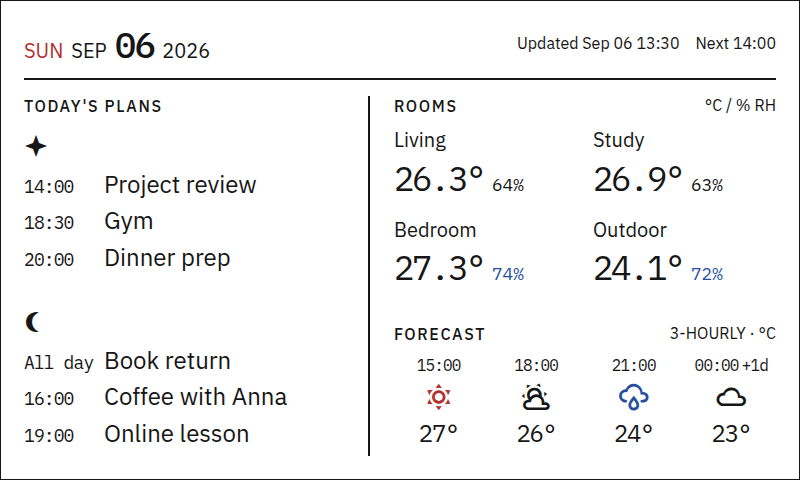

# 画面仕様 — Layout B

**状態: デザイン確定。** 800×480の固定レイアウト。表示値と予定は作例であり、実データの受入確認は実装時に行う。

## 配置と余白

座標は左上原点、単位はpx。外周24px、上部バーの下線と左右の境界線は黒2px。各セクションの見出しは文字と余白で揃える。

| 領域 | x | y | 幅 | 高さ |
|---|---:|---:|---:|---:|
| 上部バー | 24 | 24 | 752 | 56 |
| 日付 | 24 | 24 | 296 | 40 |
| 更新情報・状態overlay | 344 | 24 | 432 | 40 |
| カレンダー列 | 24 | 96 | 346 | 360 |
| Starの予定領域 | 24 | 128 | 324 | 152 |
| Moonの予定領域 | 24 | 304 | 324 | 152 |
| Rooms | 394 | 96 | 382 | 200 |
| Forecast | 394 | 324 | 382 | 132 |

カレンダー列の右端2pxを境界線とし、その内側に20pxの余白を取る。左右列の間隔は24px。上部バー下端から本文まで16px。

- TODAY'S PLANS / ROOMS / FORECASTの見出し枠は高さ20px、その直後に12pxの余白を置く。
- StarとMoonの予定領域の間隔は24px。所有者見出しは高さ36px、24pxのアイコンを上下中央に配置する。
- 各予定は時刻列72px、間隔8px、タイトル列の順。タイトル行の高さ28.8px、行の下マージン8px。所有者見出しから最初の予定まで約6px。
- Starの3件目の行下端からMoonアイコン上端まで約38pxを確保する。予定が少ない場合もMoonを上へ詰めない。
- Roomsのグリッドは2列×2行。列間16px、行間約19px。部屋名から温湿度の行まで約6px。
- Roomsの割当領域下端からForecastまで28px。Rooms下段の数値行下端からForecast見出し上端まで約36pxを確保する。
- Forecastは4等分の列と列間8px。時刻・アイコン・気温を中央揃えで縦に並べ、それぞれの間隔を6pxにする。

約38px/36pxはブラウザーのレイアウトボックス間の計測値。製品レンダラーでは表の整数座標を基準とし、字形と行ボックスの丸めを含め±1pxで合わせる。予定タイトルやアイコンのサイズを縮小して余白を確保しない。

## 書体とアイコン

| 用途 | 書体・太さ | サイズ |
|---|---|---:|
| 日付の大きな数字 | IBM Plex Mono 500 | 36px |
| 日付の曜日・月・年 | IBM Plex Sans 400 | 20px |
| セクション見出し | IBM Plex Sans 500、字間0.1em | 16px |
| 予定タイトル | IBM Plex Sans 400、日本語はNoto Sans JP 400 | 24px |
| 予定時刻 | IBM Plex Mono 400 | 18px |
| 部屋名 | IBM Plex Sans 400 | 20px |
| 室温 | IBM Plex Mono 400 | 34px |
| 湿度 | IBM Plex Mono 400 | 約18px |
| 更新情報・状態・単位 | IBM Plex Sans 400 | 16px |
| 予報時刻 / 気温 | IBM Plex Mono 400 | 16px / 24px |
| 所有者アイコン | MDI、黒白 | 24px |
| 天候アイコン | MDI、単色 | 32px |

所有者は固定順で、Starに`mdi:star-four-points`、Moonに`mdi:moon-waning-crescent`を割り当てる。画面ではアイコンで示し、設定とアクセシブル名にもStar / Moonを使用し、個人名を保存しない。

MDIは`@mdi/font` 7.4.47相当の字形を基準とする。HA側に版・ハッシュ・ライセンスを固定したフォント/アイコンと予備マスクを同梱し、最終画像へ合成する。端末は完成した4bpp画像を表示する。素材欠落時は同じ字形の予備マスクを使い、両方無効ならフレーム生成を失敗させる。ライセンスと出典は[素材情報](mockups/README.md)。

## 色

背景は白、本文・所有者マーク・罫線は黒。日曜と晴れのアイコンは赤、雨/雪/夜のアイコンは青、雲は黒。湿度70%以上は数値を青にするが、警報判定には使わない。天候の意味は色とアイコンの形を併用する。

出力は黒・白・黄・赤・青・緑の6色パレットに限定する。所有者アイコンの領域は黒白の2値。文字・罫線・アイコンは単色で描き、中間色のディザは使わない。色コードは実パネルの色票検証後に固定する。

## 上部バー

左に`SUN SEP 06 2026`、右に`Updated Sep 06 13:30` / `Next 14:00`を表示する。日付は表示TZでの生成日。更新日時は表示している情報の取得日時を基準にする。現在時刻の時計ではない。

| 状態 | 右側の表示 |
|---|---|
| 正常 | `Updated Sep 06 13:30` / `Next 14:00` |
| 古い値を表示 | `Stale · Sep 06 13:30` / `Next 14:00` |
| 通信断 | `Offline` / `Last Sep 06 13:30` |
| 時計未同期 | `Time not synced`と復元できる取得日時 |

キャッシュ表示時は、表示中の情報のうち最も古い取得日時を使う。年が日付欄と異なる場合は取得年も明記する。長い日時・状態は予約領域内の2行に収め、16px未満へ縮小しない。共通の上部バーに収め、取得元名、As of、Homeタイトル、下端の情報欄を置かない。通信断時のローカル描画は[通信契約](contracts/device-api.md)に従う。

## Today's plans

各人にHAのcalendar entityを1つ設定し、独立した領域に最大3件を表示する。個人名やHA personからentityを推測しない。

当日の終日予定→進行中→今後の開始時刻順。時刻欄は`All day` / `Now` / 24時間の`HH:mm`。終了済みは表示しない。詳細な日付・重複・件数上限の処理は[データモデル](data-model.md)に従う。

超過分は所有者アイコンの右に`+N more`。片方に空きがあっても再配分しない。日本語を含む予定タイトルは翻訳せず、描画幅で1行に省略する。

取得成功0件は`No events today`、未設定は`Calendar not linked`、利用可能なキャッシュもない取得失敗は`Unavailable`。前回値を使う場合はその所有者の領域に`Stale`を添える。

## Rooms

左上Living、右上Study、左下Bedroom、右下Outdoor。Outdoorは屋外の実測値。見出し右に`°C / % RH`、各場所に温度と湿度を表示する。温度は小数1桁、湿度は整数へ丸める。負のゼロは0へ正規化する。欠損は該当値だけ`—`とし、0へ置換しない。entity割当は[調査根拠](research.md)。

## Forecast

見出し右に`3-HOURLY · °C`。生成時刻以上の最初の3時間境界から4枠の時刻・天候・気温を表示し、翌日の時刻には`+1d`を添える。選択・単位・欠損・昼夜・鮮度の規則は[予報仕様](forecast.md)。

## 受入

基準画像、上記座標、書体・アイコン・余白をレンダラーのgolden試験に使う。各人3件/超過/未設定/取得失敗、長い英語/日本語、予報の翌日/欠損/負温度、上部状態欄の長い日時を800×480内へ収める。最終4bppを再展開して色数と配置を検証し、実機1mの距離で文字・Star/Moon・天候を識別できることを確認する。
